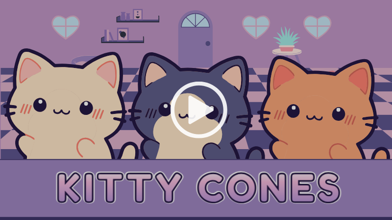

# [Kitty Cones](https://kitty-cones.pages.dev/)

### Game Description
You're the head server at Kitty Cones, a cute little ice cream shop that caters to catty customers. Your first shift just started, so get to work! Match customer orders by selecting the correct cone and scoop combinations before time runs out. 

### Video Demo (Link)

### Features
✦ Cute animated cat customers
 ✦ Fast-paced gameplay with a timer
 ✦ Playful background music and sound effects
 ✦ Responsive design for mobile and desktop

### How to Play

1. Check customer order
 2. Click matching cone
 3. Click matching scoop(s)
 4. Click customer to serve
 5. ??????????????????????
 6. Profit

### Game Modes
✦ **Normal Mode**: Standard gameplay where your catty customers slowly move across the screen
 ✦ **Rush Hour Mode**: Faster and more challenging gameplay where customers move much quicker
 These modes can be switched back and forth in-game. Toggle the mode to Rush Hour to kick things into high gear and get customers moving faster; if it's too much, you can switch right back to Normal Mode to slow customers down.

### Technical Details
✦ Built with React using React Router and context
 ✦ Responsive design using CSS Flexbox and Grid
 ✦ Local storage for saving high scores
 ✦ Global leaderboard integration using Val Town

### Dependencies
✦ React
 ✦ React Router
 ✦ Material UI Icons
 ✦ Radix UI Buttons
 ✦ Motion Animations

